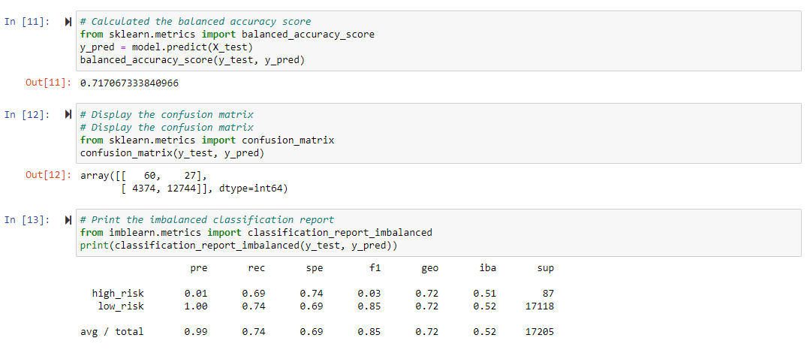
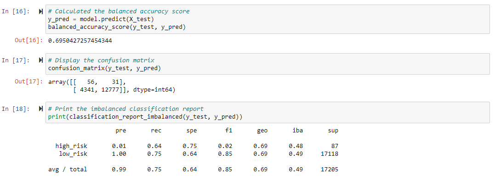
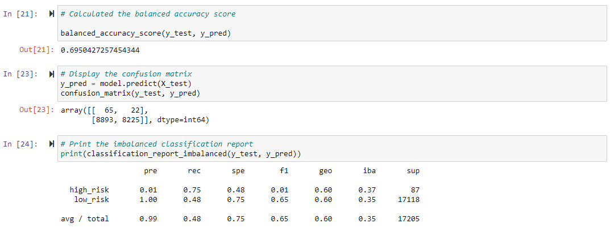
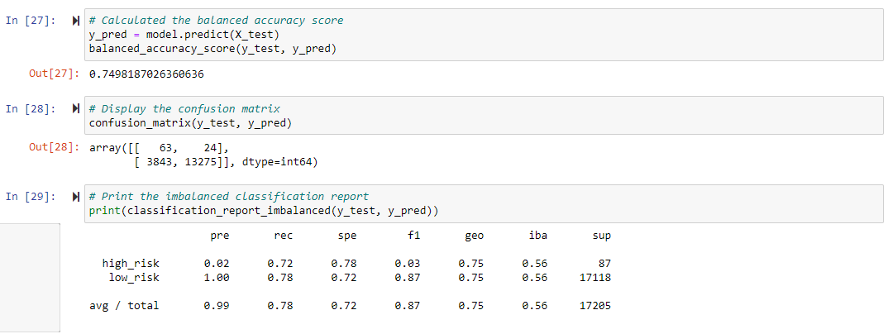
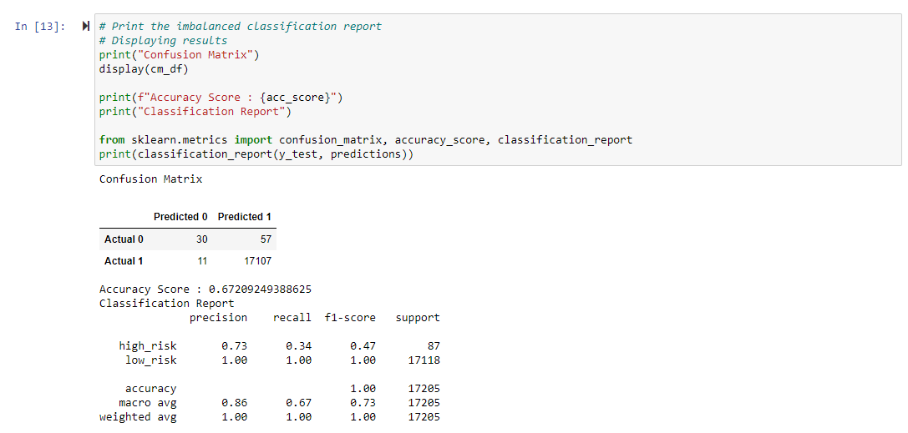
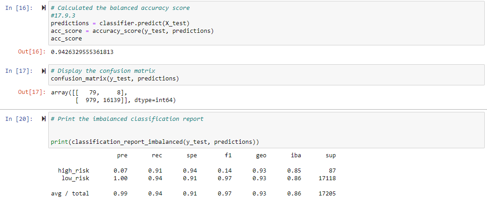

# Credit_Risk_Analysis

## Overview
Reviewing credit loan applications data provided by LendingClub using imbalanced-learn and scikit-leark libraries for resamling. Then applying machine learning to predict loan application approvals.
## Resampling
- RandomOverSampling (oversampling)
- SMOTE (oversampling)
- ClusterCentroids (undersampling)
- SMOTEENN (oversampling/undersampling)

## Using Machine Learning to predict risk.
- BalancedRandomForestClassifier
- EasyEnsembleClassifier

## Recommendation based on results.

## Results

### Sampling
#### RandomOverSampling
 
- **Balanced Accuracy** : The balanced accuracy is ~71.7 Percent.
- **Precision** : The precision for high_risk is 1 Percent which is very low.
- **Recall** : The recall rate for high_risk is 74 Percent.

#### SMOTE
 
- **Balanced Accuracy** : The balanced accuracy is ~69.5 Percent.
- **Precision Scores** : The precision for high_risk is 1 Percent which is very low.
- **Recall Scores** : The recall rate for high_risk is 64 Percent.

#### ClusterCentroids
 
- **Balanced Accuracy** : The balanced accuracy is ~69.5 Percent.
- **Precision Scores** :The precision for high_risk is 1 Percent which is very low.
- **Recall Scores** :The recall rate for high_risk is 75 Percent.

#### SMOTEENN
 
- **Balanced Accuracy** : The balanced accuracy is ~75 Percent
- **Precision Scores** :The precision for high_risk is 2 Percent which is very low.
- **Recall Scores** :The recall rate for high_risk is 72 Percent.

### Machine Learning

#### BalancedRandomForestClassifier
 
- **Balanced Accuracy** : The balanced accuracy is ~67.2 Percent.
- **Precision Scores** :The precision for high_risk is 73 Percent which is very low.
- **Recall Scores** :The recall rate for high_risk is 34 Percent.

#### EasyEnsembleClassifier
 
- **Balanced Accuracy** : The balanced accuracy is ~94.2 Percent.
- **Precision Scores** :The precision for high_risk is 7 Percent which is very low.
- **Recall Scores** :The recall rate for high_risk is 91 Percent.

## Summary